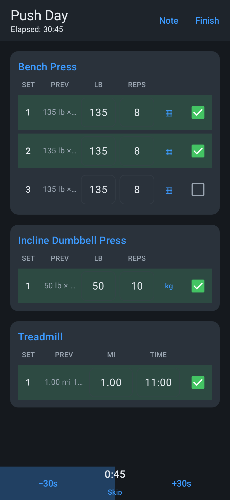

# ironlog



An offline lifting and PT tracker for Android. Log every set in pounds, get evidence-based
suggestions for when to add weight, and keep your data on your phone.

- **Pounds-native.** Weight is entered and stored in lb; the app converts to kg only where a
  machine's stack is labeled in kg.
- **Timed and cardio sets**, not just weight-and-reps: holds, distance, and pace all get their
  own columns.
- **Evidence-based progression suggestions**, each with a citation, shown as a prompt you accept
  or dismiss — nothing is changed automatically.
- **Non-destructive templates.** Changing how an exercise is logged, or swapping it out, never
  deletes anything you've already recorded.
- **Weekly JSON auto-backup**, so your history survives a lost or wiped phone.
- **Share a workout as a PDF** — the same set-by-set wording shown on screen, ready to send.
- **Import your history** from a CSV export of your previous tracker.

## Design rules

- Nothing leaves the phone. There is no account, no server, and no analytics.
- Suggestions are just that — the app never auto-changes a logged weight or rep count.

## Building

Requirements: JDK 17, Android Gradle Plugin 8.5.2, Kotlin 1.9.25.

```
./gradlew assembleDebug
```

The debug APK is written to `app/build/outputs/apk/debug/`.

## License

MIT — see [LICENSE](LICENSE).
